# Vehicle_Management_System
Hi!, welcome to my repository. The **Vehicle Management System(VMS)** project was created to manage vehicles and their trip information of a carrental business. It contains
features as managing vehicles, drivers, trips and expenses. This is an great system for managing car renting business owners. Hope you like it :)

# Getting Started

These instructions will get you a copy of the project up and running on your local machine for development and testing purposes. 

## Prerequisites

It is good to have basic knowledge of HTML, CSS, PHP, MySQL and Bootstrap to understand this project.
>We will use XAMP server as it has cross-platform support and we won't be needed to worry about the operating system support.
Download and install suitable XAMP server from this link - https://www.apachefriends.org/download.html

## Setting up the environment

- Download and extract project source code on your local machine.
- Paste the source code in the htdocs folder. Default path will be here("C:\xampp\htdocs")
- Open XAMP Control Panel and start Apache & MySQL service
- Open your web browser and paste this link ("http://localhost/phpmyadmin/"). It should open database server page.
- Create new empty database named carrental. Select the carrental database and import the SQL file given with the source code.
- Review the config file from both of the includes folders. Change username and password accordingly.
- Open your web browser and paste this link ("http://localhost/foldername-in-htdocs-directory/"). It should open login page.
- Use any credentials from database to login. The password for all accounts is set to **12345**

# Screenshots

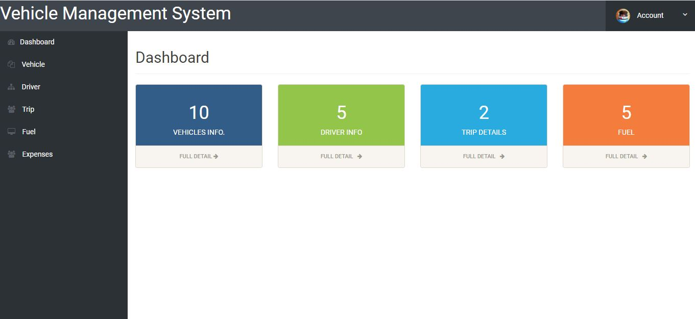

***

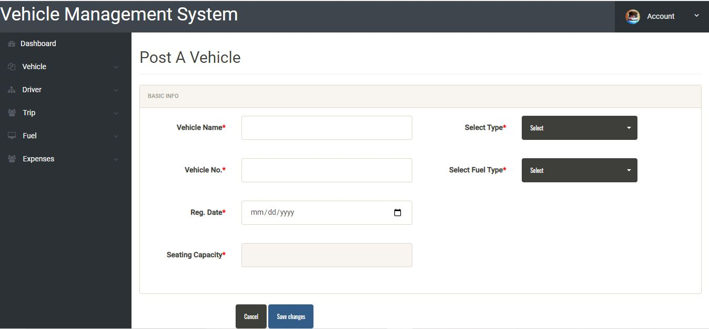

***

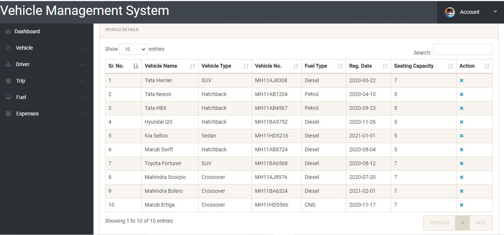

***

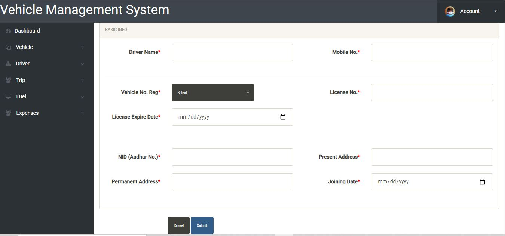

***

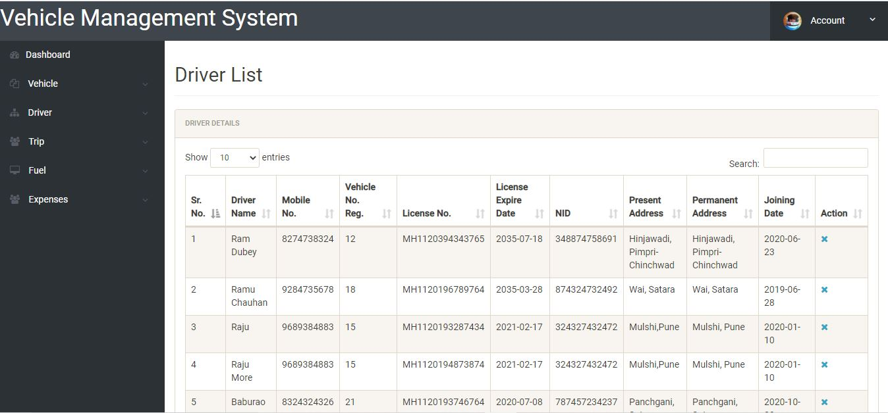

***

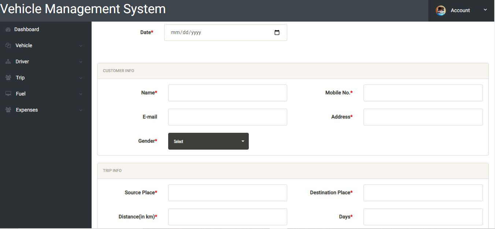

***

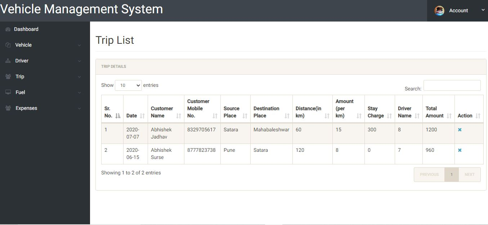

***

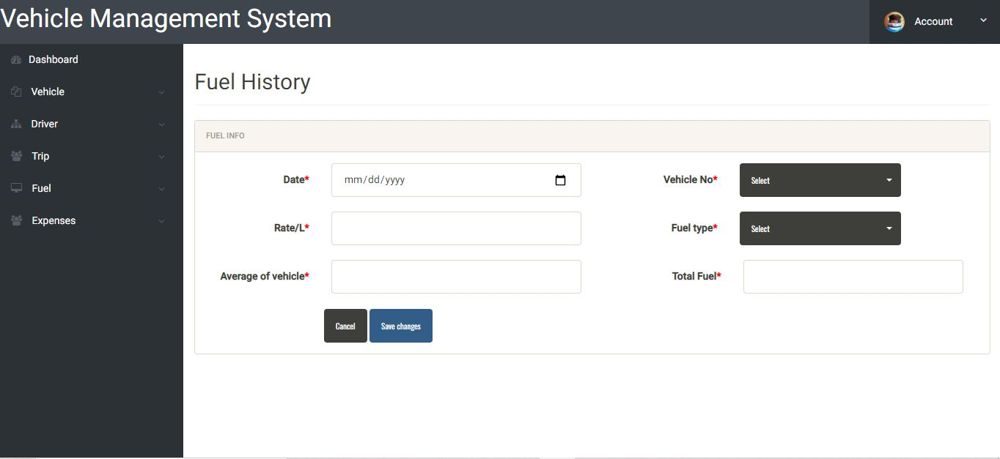

***

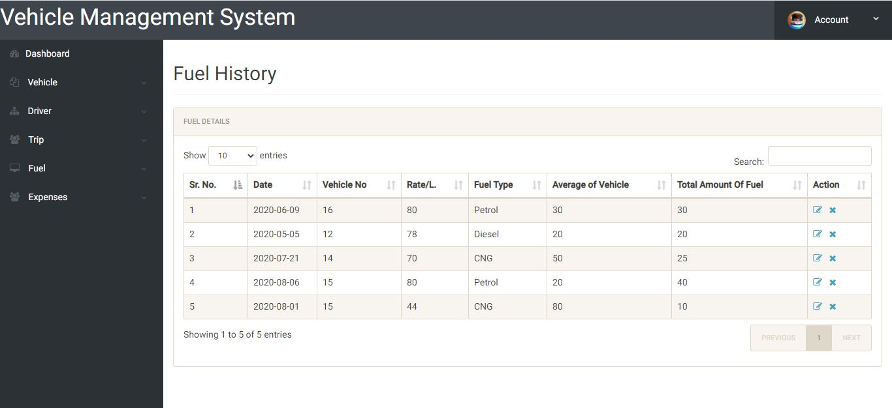

***

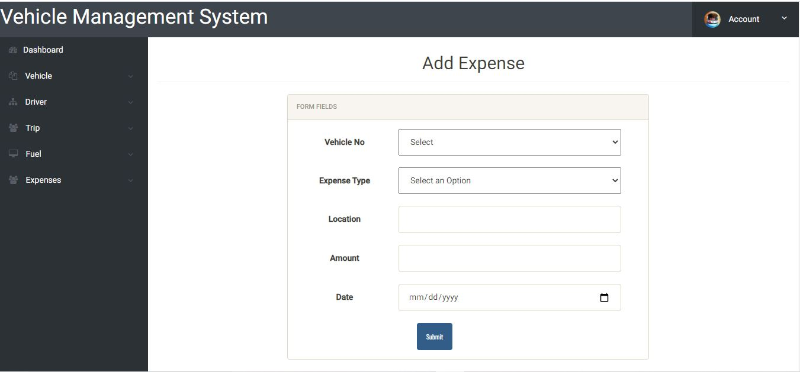

***

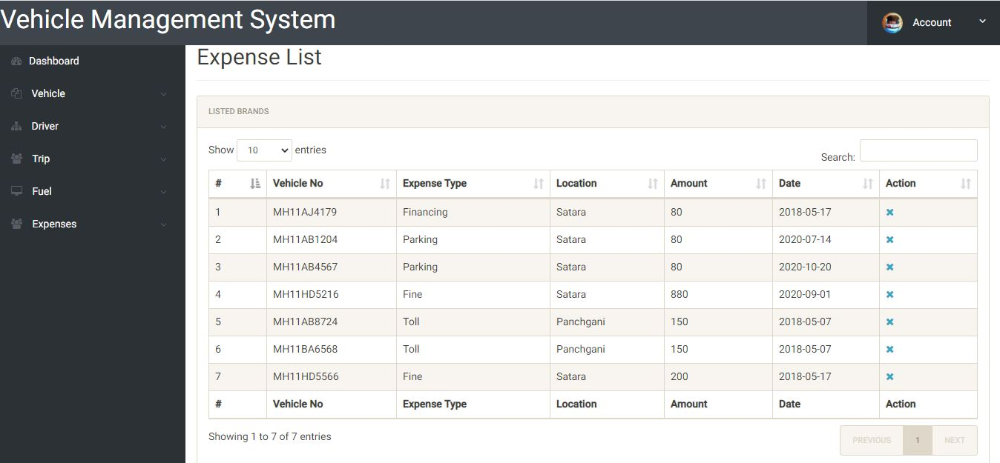

***

# Thank you for reading !
